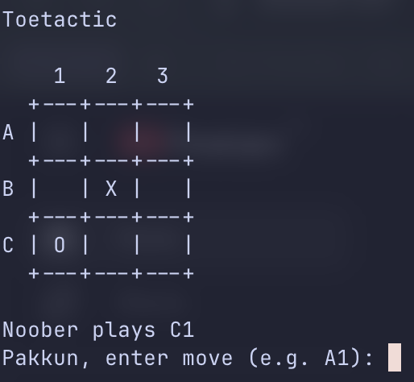

<!-- BEGIN:AVATAR -->

<!-- END:AVATAR -->

<!-- BEGIN:BADGES -->
[](https://github.com/littlegodzillalaboratory/toetactic/actions?query=workflow%3ACI)
[](https://github.com/littlegodzillalaboratory/toetactic/actions?query=workflow%3ACodeQL)
[](https://libraries.io/github/littlegodzillalaboratory/toetactic)
[](https://snyk.io/test/github/littlegodzillalaboratory/toetactic)
[](https://pypi.python.org/pypi/toetactic)
<!-- END:BADGES -->

# Toetactic

A terminal Tic Tac Toe game where you can battle four AI opponents:

* Dikembe: purely defensive, focused on blocking your lines.
* Godzilla: aggressive, always looking for direct winning opportunities.
* Noober: picks any legal move at random, hoping for luck.
* Eleanor: builds rows and columns, avoiding diagonals unless it has no other legal move.



## Installation

```shell
pip3 install toetactic
```

## Usage

Run the game:

```shell
toetactic
```

The game will prompt you for:

1. Board dimension (default: 3)
2. Your player name
3. Opponent (`dikembe`, `godzilla`, `noober`, or `eleanor`)

Then enter your moves using chess-like coordinates such as `A1`, `B3`, `C2`.

Show help guide:

```shell
toetactic --help
```

## Colophon

<!-- BEGIN:DEVELOPERS_GUIDE -->
[Developer's Guide](https://littlegodzillalaboratory.github.io/developers-guide-python.html)
<!-- END:DEVELOPERS_GUIDE -->

<!-- BEGIN:BUILD_REPORTS -->
Build reports:

* [Lint report](https://littlegodzillalaboratory.github.io/toetactic/lint/pylint/index.html)
* [Code complexity report](https://littlegodzillalaboratory.github.io/toetactic/complexity/radon/index.html)
* [Unit tests report](https://littlegodzillalaboratory.github.io/toetactic/test/pytest/index.html)
* [Test coverage report](https://littlegodzillalaboratory.github.io/toetactic/coverage/coverage/index.html)
* [Integration tests report](https://littlegodzillalaboratory.github.io/toetactic/test-integration/pytest/index.html)
* [API Documentation](https://littlegodzillalaboratory.github.io/toetactic/doc/sphinx/index.html)

<!-- END:BUILD_REPORTS -->
